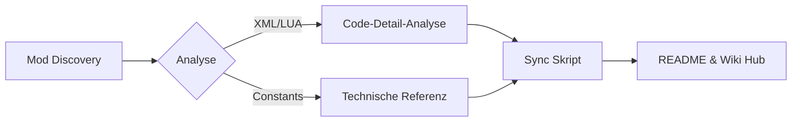

# 🏙️ Projekt-Entwicklung & Workspace Übersicht

Die Evolution des **CC2 Mod-Forschungslabors** – von einer einfachen Dateisammlung zu einer automatisierten Entwicklungsplattform.

---

## 📈 Die Evolutions-Phasen

| Phase | Fokus | Ergebnis |
| :--- | :--- | :--- |
| **Pionier-Zeit** | Sammeln & Sortieren | Erster Mod-Ordner mit ~20 Einträgen. |
| **Strukturierung** | Ordner-Kategorien | Einführung von `mods/Audio`, `mods/UI`, etc. |
| **Automatisierung** | CI/CD & Skripte | Auto-Sync der README und GitHub Actions. |
| **Forschungs-Era** | Dekonstruktion | Tiefenanalyse von Weapon-IDs und LUA-Logik. |

---

## 🏗️ Technischer Stack (Workflow)

---

## 📂 Aktuelle Workspace-Struktur

| Ordner | Inhalt | Status |
| :--- | :--- | :--- |
| `mods/` | Archiv für mod.xml basierte Erweiterungen. | ✅ Organisiert |
| `wiki_new/` | Speicherort für dieses Premium-Wiki. | 🚀 Aktiv |
| `scripts/` | Python-Automatisierungstools. | 🛠️ Stabil |
| `.github/` | Workflows & Detail-Berichte. | 🔬 Forschungslabor |

---

## 🚦 Projekt-Status Quo

| Metrik | Wert |
| :--- | :--- |
| **Stabilitäts-Index** | 🟢 100% (Alle Pfade verifiziert) |
| **Dokumentations-Tiefe** | 🟠 80% (Detail-Analysen laufen) |
| **Automatisierungs-Grad** | 🔵 Hoch (Sync via Python) |

---
> [!IMPORTANT]
> **Aktuelles Ziel**: Vollständige Dekonstruktion der `Island_turret_placement_QoL` Mod, um die Platzierungs-Logik der Verteidigungstürme für eigene Maps nutzbar zu machen.
